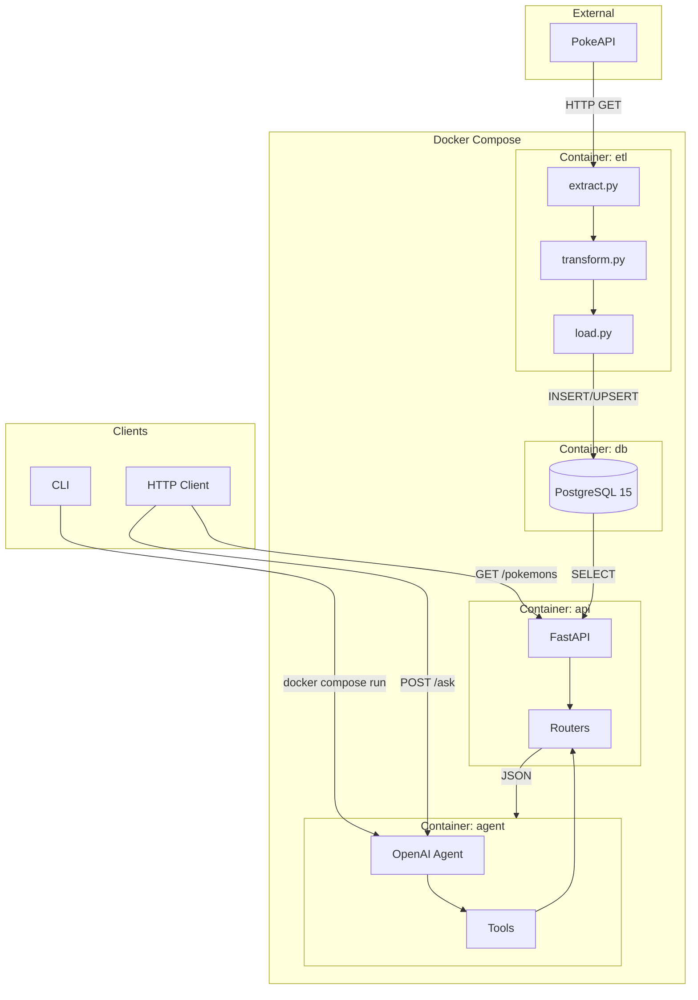

# Pokemon Data Pipeline


---

## Visao Geral

Pipeline de dados end-to-end que extrai informacoes dos 151 Pokemon da primeira geracao via PokeAPI, processa e armazena em PostgreSQL, expoe via API REST e permite consultas em linguagem natural atraves de um Agente de IA.

**Fonte de dados:** [PokeAPI](https://pokeapi.co/) - API publica gratuita com dados completos de Pokemon. Escolhida por oferecer dados semi-estruturados e aninhados que permitem modelagem relacional real, alem de possibilitar transformacoes, normalizacoes e agregacoes relevantes.

---

## Arquitetura



### Fluxo de Dados

1. **Extract**: Busca dados brutos da PokeAPI (151 Pokemon + abilities)
2. **Transform**: Limpa, normaliza e estrutura os dados para o modelo relacional
3. **Load**: Persiste no PostgreSQL com upsert (idempotente)
4. **API**: Expoe endpoints REST para consulta dos dados processados
5. **Agent**: Responde perguntas em linguagem natural usando as tools que consultam a API

---

## Tecnologias Utilizadas

| Tecnologia | Versao | Justificativa |
|------------|--------|---------------|
| Python | 3.11+ | Versao LTS com suporte a type hints modernos e performance otimizada |
| FastAPI | 0.109+ | Framework async com validacao automatica via Pydantic e docs OpenAPI |
| PostgreSQL | 15 | Banco relacional robusto com suporte a UPSERT e JSON |
| SQLAlchemy | 2.0+ | Gerenciamento de conexoes e pool; queries em SQL puro para performance |
| psycopg2 | 2.9+ | Driver PostgreSQL nativo de alta performance |
| httpx | 0.27+ | Cliente HTTP moderno com suporte async e retry |
| structlog | 24.1+ | Logging estruturado em JSON para observabilidade |
| OpenAI Agents SDK | 0.1+ | SDK oficial para construcao de agentes com function calling |
| Docker | 24+ | Containerizacao para reproducibilidade e isolamento |
| GitHub Actions | - | CI/CD integrado ao repositorio com workflow declarativo |

---

## Pre-requisitos

- **Docker Desktop** 24+ instalado e rodando
- **Conta OpenAI** com API key ativa (modelo gpt-4o-mini ou superior)
- **Git** para clonar o repositorio
- **8GB RAM** disponivel (recomendado para rodar os 4 containers)

---

## Como Subir o Projeto

### 1. Clonar o repositorio

```bash
git clone https://github.com/USUARIO/desafio-data-engineer.git
cd desafio-data-engineer
```

### 2. Configurar variaveis de ambiente

```bash
cp .env.example .env
```

Edite o arquivo `.env` e preencha:

```env
POSTGRES_USER=pokemon_user
POSTGRES_PASSWORD=sua_senha_segura
POSTGRES_DB=pokemon_db
OPENAI_API_KEY=sk-sua-chave-aqui
```

### 3. Subir os containers

```bash
docker compose up --build -d
```

### 4. Verificar status

```bash
docker compose ps
```

Todos os containers devem estar com status `healthy` ou `running`:

```
NAME            STATUS
pokemon_db      healthy
pokemon_api     running
pokemon_agent   running
```

### 5. Verificar logs (opcional)

```bash
docker compose logs -f api
```

---

## Como Executar a Pipeline ETL

A pipeline ETL extrai os 151 Pokemon da primeira geracao, transforma os dados e carrega no PostgreSQL.

### Executar manualmente

```bash
docker compose run etl
```

### O que esperar nos logs

```json
{"event": "pipeline_started", "level": "info", "timestamp": "...", "limit": 151}
{"event": "pokemon_extracted", "level": "info", "pokemon_id": 1, "pokemon_name": "bulbasaur"}
...
{"event": "load_completed", "level": "info", "pokemons": 151, "types": 15, "abilities": 98}
{"event": "pipeline_completed", "level": "info", "total_elapsed_ms": 45000}
```

### Verificar dados carregados

```bash
docker compose exec db psql -U pokemon_user -d pokemon_db -c "SELECT COUNT(*) FROM pokemon;"
```

Resultado esperado: `151`

### Executar com limite reduzido (para testes)

```bash
docker compose run -e POKEMON_LIMIT=10 etl
```

---

## Endpoints da API

A API roda na porta 8000 e possui documentacao interativa em `/docs`.

| Metodo | Rota | Descricao |
|--------|------|-----------|
| GET | `/pokemons` | Lista Pokemon com paginacao |
| GET | `/pokemons/{name_or_id}` | Detalhes de um Pokemon |
| GET | `/pokemons/type/{type}` | Pokemon por tipo |
| GET | `/pokemons/stats/top` | Ranking por stat |
| GET | `/pokemons/compare` | Comparacao entre dois Pokemon |
| GET | `/health` | Health check da API |

### Exemplos de uso

**Listar Pokemon (paginado)**

```bash
curl http://localhost:8000/pokemons?limit=5&offset=0
```

```json
{
  "items": [
    {"id": 1, "name": "bulbasaur", "height": 7, "weight": 69, "types": ["grass", "poison"]},
    {"id": 2, "name": "ivysaur", "height": 10, "weight": 130, "types": ["grass", "poison"]}
  ],
  "total": 151,
  "limit": 5,
  "offset": 0
}
```

**Buscar Pokemon por nome**

```bash
curl http://localhost:8000/pokemons/pikachu
```

```json
{
  "id": 25,
  "name": "pikachu",
  "height": 4,
  "weight": 60,
  "base_experience": 112,
  "stats": {
    "hp": 35,
    "attack": 55,
    "defense": 40,
    "special_attack": 50,
    "special_defense": 50,
    "speed": 90
  },
  "types": [{"id": 13, "name": "electric"}],
  "abilities": [{"id": 9, "name": "static", "description": "..."}]
}
```

**Pokemon por tipo**

```bash
curl http://localhost:8000/pokemons/type/fire
```

**Ranking por stat**

```bash
curl "http://localhost:8000/pokemons/stats/top?stat=attack&limit=5"
```

```json
{
  "stat": "attack",
  "items": [
    {"rank": 1, "id": 68, "name": "machamp", "stat_name": "attack", "stat_value": 130},
    {"rank": 2, "id": 57, "name": "primeape", "stat_name": "attack", "stat_value": 105}
  ]
}
```

**Comparar dois Pokemon**

```bash
curl "http://localhost:8000/pokemons/compare?pokemon_a=pikachu&pokemon_b=raichu"
```

```json
{
  "pokemon_a": {"id": 25, "name": "pikachu", "...": "..."},
  "pokemon_b": {"id": 26, "name": "raichu", "...": "..."},
  "stat_comparison": [
    {"stat": "hp", "pokemon_a": 35, "pokemon_b": 60, "diff": -25, "winner": "raichu"},
    {"stat": "speed", "pokemon_a": 90, "pokemon_b": 110, "diff": -20, "winner": "raichu"}
  ],
  "summary": "raichu vence em 6 stats"
}
```

---

## Como Usar o Agente de IA

O Agente responde perguntas sobre Pokemon em linguagem natural, consultando os dados da pipeline.

### Via CLI

```bash
docker compose run agent "Qual Pokemon tem o maior ataque?"
```

**Exemplos de perguntas e respostas:**

| Pergunta | Resposta esperada |
|----------|-------------------|
| `"Qual Pokemon tem o maior ataque?"` | Machamp com 130 de ataque |
| `"Liste os Pokemon do tipo fogo"` | Charmander, Charmeleon, Charizard, Vulpix... |
| `"Compare Pikachu com Raichu"` | Raichu e superior em todos os stats exceto... |
| `"Quais sao os 5 Pokemon mais rapidos?"` | Electrode (150), Jolteon (130), Aerodactyl (130)... |
| `"Quais habilidades o Bulbasaur tem?"` | Overgrow e Chlorophyll (hidden) |

### Via POST /ask

O Agente tambem expoe um endpoint HTTP na porta 8001.

```bash
curl -X POST http://localhost:8001/ask \
  -H "Content-Type: application/json" \
  -d '{"question": "Quem e mais forte, Charizard ou Blastoise?"}'
```

```json
{
  "answer": "Comparando Charizard e Blastoise:\n\n- Charizard tem maior Special Attack (109 vs 85)\n- Blastoise tem maior Defense (100 vs 78) e Special Defense (105 vs 85)\n- Ambos tem a mesma Speed (78)\n\nNo geral, Blastoise e mais defensivo enquanto Charizard e mais ofensivo. Depende do estilo de batalha desejado."
}
```

---

## Pipeline CI/CD

O projeto usa GitHub Actions para integracao continua.

### Jobs

| Job | Descricao | Dependencia |
|-----|-----------|-------------|
| **lint** | Executa Ruff para verificar estilo e erros de codigo | - |
| **test** | Roda pytest nos testes unitarios | lint |
| **build** | Constroi as imagens Docker para validar que compilam | test |

### Eventos

- **push** na branch `main`
- **pull_request** para branch `main`

### Verificar status

Acesse a aba "Actions" no repositorio GitHub ou verifique o badge no topo deste README.

---

## Estrutura do Projeto

```
.
├── .github/workflows/ci.yml    # Pipeline CI/CD
├── api/                        # Servico FastAPI
│   ├── main.py
│   ├── database.py
│   ├── routers/
│   ├── schemas/
│   ├── Dockerfile
│   └── requirements.txt
├── agent/                      # Agente de IA
│   ├── agent_app.py
│   ├── tools.py
│   ├── logger.py
│   ├── Dockerfile
│   └── requirements.txt
├── etl/                        # Pipeline ETL
│   ├── extract.py
│   ├── transform.py
│   ├── load.py
│   ├── main.py
│   ├── Dockerfile
│   └── requirements.txt
├── db/
│   └── init.sql                # Schema do banco
├── tests/                      # Testes unitarios
│   ├── etl/
│   ├── api/
│   └── agent/
├── docker-compose.yml
├── .env.example
└── README.md
```

---

## Possiveis Melhorias Futuras

### 1. Cache de requisicoes na API

**O que e:** Implementar cache Redis para endpoints frequentes como listagem e busca por tipo.

**Por que agrega valor:** Reduz carga no banco e latencia de resposta em 10x para consultas repetidas.

### 2. Pipeline incremental

**O que e:** Modificar o ETL para buscar apenas Pokemon novos ou atualizados desde a ultima execucao.

**Por que agrega valor:** Permite rodar a pipeline periodicamente sem reprocessar todos os 151 Pokemon, economizando tempo e requests.

### 3. Tracing distribuido

**O que e:** Integrar OpenTelemetry para rastrear requisicoes end-to-end entre API, Agent e banco.

**Por que agrega valor:** Facilita debug de problemas de performance e identifica gargalos em producao.

### 4. Autenticacao na API

**O que e:** Adicionar JWT ou API keys para proteger os endpoints.

**Por que agrega valor:** Permite controle de acesso e rate limiting por usuario em ambiente de producao.

### 5. Suporte a mais geracoes

**O que e:** Expandir a pipeline para extrair Pokemon de todas as geracoes (900+).

**Por que agrega valor:** Aumenta a base de dados e possibilita analises mais ricas sobre evolucao dos stats ao longo das geracoes.

---

## Contato

Desenvolvido para o desafio tecnico TOTVS IDEIA - Engenharia de Dados.
